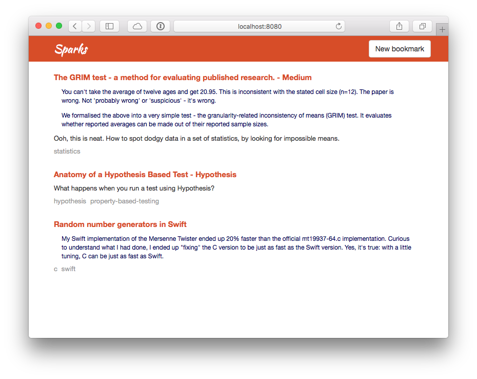

# swift-bookmarks

This is a tiny web-app I wrote while I was learning Swift.  It's just a simple bookmarking app:



It's pretty basic, but it was enough to get me started:corp

*   You can view a list of bookmarks.
*   You can add a new bookmark with the "New bookmark" button.
*   Clicking the tags below an item will let you see all the bookmarks with that tag.

## Installation

You'll need Xcode installed.  I was using Xcode&nbsp;7.3.1 when I wrote this, although I assume it's similar with other versions.

Install [Carthage][carthage]:

    ```console
    $ brew update
    $ brew install carthage
    ```

Then install the dependencies from Carthage:

    ```console
    $ carthage update
    ```

Finally, start the server with `xcrun`:

    ```console
    $ xcrun swift -F Carthage/Build/Mac -target x86_64-macosx10.10 bookmarks.swift
    ```

If you navigate to <http://localhost:8080/> in your browser, you should see the running application.

## Known issues

*   Any non-ASCII character in the POST request seems to crash the HTTP server, so they get encoded as HTML entities before being sent to the server.  I don't know why it crashes.
*   I'm pinning to an old-ish version of Taylor, because I couldn't get any POST requests to work on the newest version.  Not sure if the library's broken or (more likely) I'm not using it correctly.

[carthage]: https://github.com/Carthage/Carthage